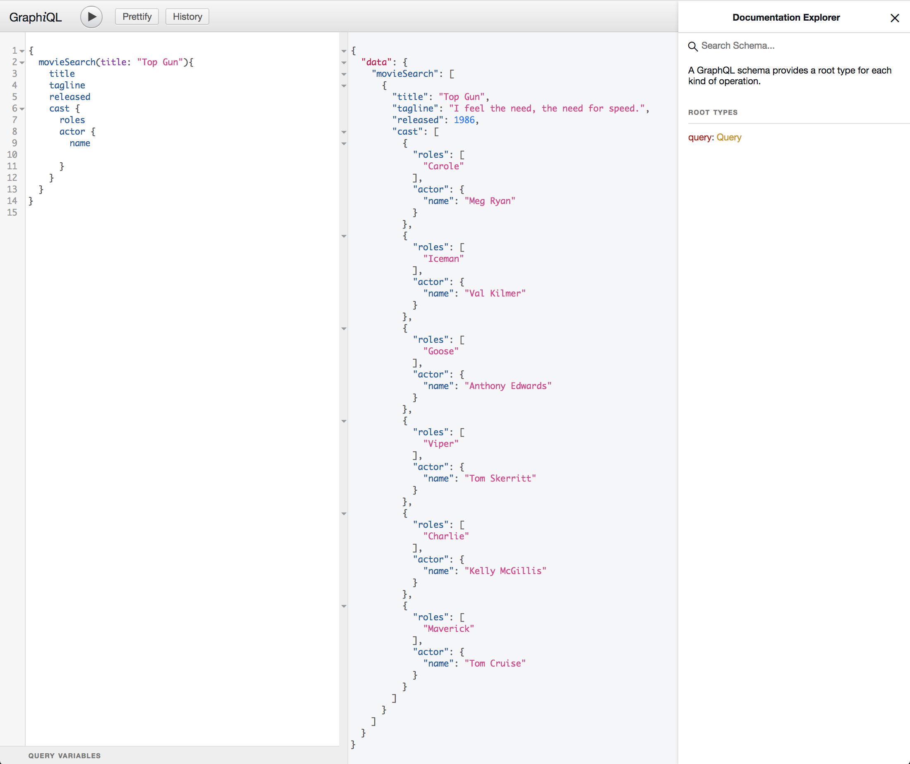

# Neo4j Movies Example Application - GraphQL JavaScript Edition


## Quickstart

* Start Neo4j ([Download & Install](http://neo4j.com/download)) locally and open the [Neo4j Browser](http://localhost:7474). 
* Install the Movies dataset with `:play movies`, click the statement, and hit the triangular "Run" button.

Optionally, set environment variables to override defaults:

    PORT = 3000,
    NEO4J_URL = "bolt://localhost:7687",
    NEO4J_USER = "neo4j",
    NEO4J_PASSWORD = "letmein"

Then

```
npm install
npm run start
```

Then navigate to `http://localhost:3000` in your browser.

## How It Works

The frontend for this example application uses jQuery, D3, and ApolloClient to query a GraphQL API.

The backend is an Express.js GraphQL service using graphql-tools and the JavaScript Neo4j driver.

JavaScript assets are transpiled and bundled using Webpack.

## Query with GraphiQL



The GraphiQL tool for querying the GraphQL service is available at `http://localhost:3000/graphiql`

